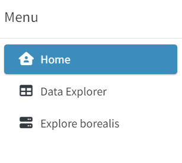

<!-- README.md is generated from README.Rmd. Please edit that file -->

# DataExplorer

<!-- badges: start -->

[](https://lifecycle.r-lib.org/articles/stages.html#experimental)
<!-- badges: end -->

The goal of DataExplorer is to enable user to explore and visualize
historical data from the Borealis database. The app enables user to
visualize the metadata for the data, check the structure of raw data,
see some basic descriptive statistics and plot the data.

## Installation

You can install DataExplorer package from [GitHub](https://github.com/)
with:

``` r
# install.packages("remotes")
remotes::install_github("agrifooddatacanada/OAC_Historical_Research_Data_Explorer_App@dev")

# Run the App
library(DataExplorer)
```

## Run the app on your local computer

You can also run the app directly on your local computer using:

``` r
DataExplorer::run_app()
```

## Acknowledgement

This shiny web application was developed as a part of the Reusable
research data made shiny workshop that was held at the University of
Guelph, Guelph Ontario Canada.


# How the app works

The front page of the App displays three tabs in the Menu as shown
below:



## 1. The home tab

The home tab gives a general description of how the app works. It
contains a link that directs users to Github repository where they can
find information and files for the workshop. It also contains a link
that direct users to the borealis database.

## 2. The Data explorer tab

## 3. The Explore borealis tab

Please note that the DataExplorer project is released with a
[Contributor Code of
Conduct](https://contributor-covenant.org/version/2/1/CODE_OF_CONDUCT.html).
By contributing to this project, you agree to abide by its terms.
